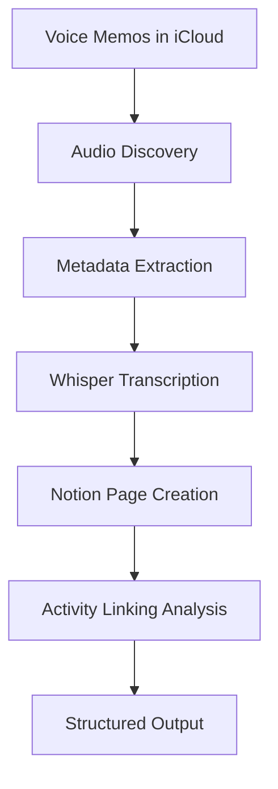

# 🎙️ Voice Memo Transcription & Notion Integration

> **Transform your Voice Memos into searchable, structured content with AI-powered transcription and intelligent activity linking**

[](https://www.python.org/downloads/)
[](https://github.com/openai/whisper)
[](https://developers.notion.com/)
[](https://www.apple.com/macos/)

A comprehensive Python workflow that automatically discovers Voice Memos from iCloud Drive, transcribes them using OpenAI Whisper, creates structured Notion pages, and intelligently suggests connections to your activities database.

## 🌟 Features

- **🔍 Smart Discovery**: Automatically finds Voice Memos across iCloud Drive locations
- **🤖 AI Transcription**: High-quality speech-to-text using OpenAI Whisper models
- **📝 Notion Integration**: Creates rich, structured pages with metadata and timestamps
- **🔗 Intelligent Linking**: Suggests 5 different strategies to connect recordings with activities
- **⏱️ Detailed Timestamps**: Provides precise segment timing for easy navigation
- **📊 Rich Metadata**: Preserves audio file details, duration, creation dates, and tags
- **🎛️ Flexible Models**: Choose from 5 Whisper models to balance speed vs accuracy
- **🚀 Easy Operation**: Simple command-line interface with batch and interactive modes

## 🏗️ Architecture

### Implementation Components



### Core Modules

- **`audio_processor.py`** - Discovers and extracts metadata from Voice Memo files
- **`transcriber.py`** - Handles Whisper transcription with configurable models
- **`notion_integration.py`** - Creates structured Notion pages and analyzes linking opportunities
- **`voice_memo_processor.py`** - Main workflow orchestrator
- **`run.sh`** - Simple launcher script for easy execution

## 🚀 Quick Start

### Installation

1. **Clone the repository**
   ```bash
   git clone https://github.com/Staff-Room/voice-memo-transcription.git
   cd voice-memo-transcription
   ```

2. **Set up the environment**
   ```bash
   python3 -m venv venv
   source venv/bin/activate
   pip install -r requirements.txt
   ```

3. **Make the launcher executable**
   ```bash
   chmod +x run.sh
   ```

### Usage

#### Interactive Mode (Recommended)
```bash
./run.sh
```

This will:
1. 📂 Discover all available Voice Memo files
2. 🎯 Let you select which recording to process
3. 📊 Extract detailed metadata using macOS tools
4. 🤖 Transcribe with Whisper (shows progress and time estimates)
5. 📝 Create a structured Notion page with rich content blocks
6. 🔗 Analyze and suggest 5 activity linking strategies
7. ✨ Provide a complete workflow summary

#### Quick File Processing
```bash
./run.sh --file "/path/to/your/recording.m4a"
```

#### List Available Files
```bash
./run.sh --list-only
```

#### Choose Whisper Model
```bash
./run.sh --model small    # Options: tiny, base, small, medium, large
```

## 🎛️ Whisper Model Selection

| Model  | Speed    | Accuracy | Use Case | Download Size |
|--------|----------|----------|----------|---------------|
| `tiny` | Fastest  | Lower    | Quick drafts, testing | ~72MB |
| `base` | Fast     | Good     | **Recommended default** | ~139MB |
| `small`| Medium   | Better   | Higher quality needs | ~244MB |
| `medium`| Slow    | High     | Professional transcription | ~769MB |
| `large`| Slowest  | Highest  | Maximum accuracy | ~1550MB |

## 🔗 Intelligent Activity Linking

The system analyzes each Voice Memo and suggests connection strategies:

### 1. **🟢 Date-based Linking** (High Confidence)
- Matches recording date with activity dates
- *"Find activities from September 19, 2024"*

### 2. **🟡 Content-based Linking** (Medium Confidence)  
- Extracts keywords from transcription text
- *"Search for activities containing: project, meeting, timeline"*

### 3. **🟡 Location-based Linking** (Medium Confidence)
- Identifies location references in speech
- *"Search for activities at: Office, Conference Room, Google Drive"*

### 4. **🟡 Tag-based Linking** (Medium Confidence)
- Matches audio file tags with activity categories
- *"Find activities tagged with: Work, Personal, Meeting"*

### 5. **🟠 Duration-based Linking** (Low Confidence)
- Finds activities with similar time lengths
- *"Find activities with similar duration (~15 minutes)"*

## 📁 Voice Memo Discovery

The system automatically searches these iCloud Drive locations:

```
~/Library/Mobile Documents/com~apple~CloudDocs/
├── Personal*/Voice memos/
├── Content Captures/
└── ZWC/*/Recordings/
```

**Supported formats:** `.m4a`, `.wav`, `.mp3`, `.aiff`, `.aac`

## 📝 Notion Page Structure

Each processed Voice Memo creates a structured page containing:

- **🏷️ Smart Title**: Generated from transcription content or filename
- **📊 Metadata Summary**: Duration, recording date, file details, model used
- **📄 Full Transcription**: Complete speech-to-text conversion
- **⏱️ Timestamped Segments**: Detailed timing for easy navigation
- **🏷️ Automatic Tags**: Based on file location, metadata, and content
- **🔍 Search-friendly Properties**: Type, source, language, word count

## 🛠️ Technical Requirements

- **Operating System**: macOS (uses `mdls` for metadata extraction)
- **Python**: 3.8 or higher
- **Memory**: 4GB+ RAM recommended for larger Whisper models
- **Storage**: ~2GB free space for model downloads
- **iCloud**: Voice Memos synced to iCloud Drive
- **Notion**: Integration via Claude Code's Notion MCP tools

## 📊 Example Output

```
🎙️  VOICE MEMO TRANSCRIPTION & NOTION INTEGRATION
================================================================

📂 Step 1: Discovering Voice Memo files...
✅ Found 12 audio files

🎯 Step 2: Select a Voice Memo to process
Available Voice Memo files (showing newest first):
--------------------------------------------------------------------------------
 1. Project Planning Session.m4a                   (2.1MB) 2024-09-19 14:30
 2. Client Call Notes.m4a                          (1.8MB) 2024-09-18 09:15
 3. Morning Thoughts.m4a                           (0.9MB) 2024-09-17 07:45

📊 Step 3: Extracting metadata for: Project Planning Session.m4a
   File: Project Planning Session.m4a
   Duration: 3:45
   Created: September 19, 2024 at 2:30 PM
   Size: 2.1 MB
   Channels: 1
   Sample Rate: 48000

🤖 Step 4: Transcribing with Whisper...
⏱️  Estimated transcription time: ~45 seconds
✅ Transcription completed successfully!

📝 Step 5: Creating Notion content page...
✅ Notion page created successfully!
📄 Page title: Discussed the new project timeline with the team

🔗 Step 6: Analyzing activity linking opportunities...
Found 5 linking suggestions:

1. 🟢 Link by Recording Date (Confidence: High)
   📋 Find activities from 2024-09-19
   💭 Voice memo was recorded on this date, likely related to same-day activities

2. 🟡 Link by Content Keywords (Confidence: Medium)
   📋 Search for activities containing: project, timeline, team, meeting, deadline
   💭 Voice memo content may reference specific activities, projects, or people

3. 🟡 Link by Location References (Confidence: Medium)
   📋 Search for activities at: Conference Room B, Main Office
   💭 Voice memo mentions specific locations that may match activity locations

4. 🟡 Link by Tags (Confidence: Medium)
   📋 Find activities tagged with: Work, Planning, Team
   💭 Audio file tags may correspond to activity categories or labels

5. 🟠 Link by Similar Duration (Confidence: Low)
   📋 Find activities with similar duration (~4 minutes)
   💭 Voice memo might be notes about a meeting/activity of similar length

📋 WORKFLOW SUMMARY
================================================================
📁 File Processed: Project Planning Session.m4a
📊 Metadata: ✅ Success
🤖 Transcription: ✅ Success (127 words)
📝 Notion Page: ✅ Created
🔗 Link Suggestions: 5 found

🎯 Next Steps:
   1. Review the Notion page content
   2. Consider the 5 linking suggestions
   3. Connect to relevant activities in your database
   4. Add any additional tags or categorization

✨ Workflow completed successfully!
```

## 🔧 Advanced Configuration

### Environment Variables

Create a `.env` file for custom configuration:

```bash
# Whisper model preference
DEFAULT_WHISPER_MODEL=base

# Custom Voice Memo paths (comma-separated)
CUSTOM_AUDIO_PATHS="/path/to/custom/recordings,/another/path"

# Notion integration settings
NOTION_CONTENT_DATABASE_ID=your_database_id
```

### Batch Processing

Process multiple files at once:

```bash
# Process all files from a specific date
find ~/Library/Mobile\ Documents/com~apple~CloudDocs/Personal*/Voice\ memos/ \
  -name "*.m4a" -newermt "2024-09-01" \
  -exec ./run.sh --file {} \;
```

## 🐛 Troubleshooting

### Common Issues

**🚫 No files found**
- Ensure Voice Memos are synced to iCloud Drive
- Check that the app has access to iCloud Documents

**⚠️ Permission errors**
- Voice Memos may require additional macOS permissions
- Grant Full Disk Access if prompted

**🐌 Slow transcription**
- Use a smaller Whisper model (`tiny` or `base`)
- Ensure sufficient RAM is available

**💾 Memory issues**
- Large audio files may require the `base` model or smaller
- Close other applications to free up RAM

**📱 Missing Voice Memos**
- Verify iCloud sync is enabled on your iPhone/iPad
- Wait for sync to complete after recording

### Performance Tips

- **For speed**: Use `tiny` model for quick drafts
- **For accuracy**: Use `small` or `medium` for important content
- **For batch processing**: Use `base` as a good balance
- **Large files**: Consider splitting long recordings

## 🤝 Contributing

We welcome contributions! Please feel free to submit issues, feature requests, or pull requests.

### Development Setup

1. Fork the repository
2. Create a feature branch
3. Make your changes with tests
4. Submit a pull request

### Code Style

- Follow PEP 8 for Python code
- Add docstrings for all functions
- Include type hints where appropriate
- Write descriptive commit messages

## 📄 License

This project is licensed under the MIT License - see the [LICENSE](LICENSE) file for details.

## 🙏 Acknowledgments

- **OpenAI Whisper** - For exceptional speech recognition capabilities
- **Notion** - For providing a robust API for content management
- **Claude Code** - For MCP tools that enable seamless Notion integration
- **Apple** - For Voice Memos and comprehensive metadata support

---

<div align="center">

**Built with ❤️ for productivity enthusiasts who want to make their voice recordings searchable and actionable**

[Report Bug](https://github.com/Staff-Room/voice-memo-transcription/issues) • [Request Feature](https://github.com/Staff-Room/voice-memo-transcription/issues) • [Documentation](https://github.com/Staff-Room/voice-memo-transcription/wiki)

</div>